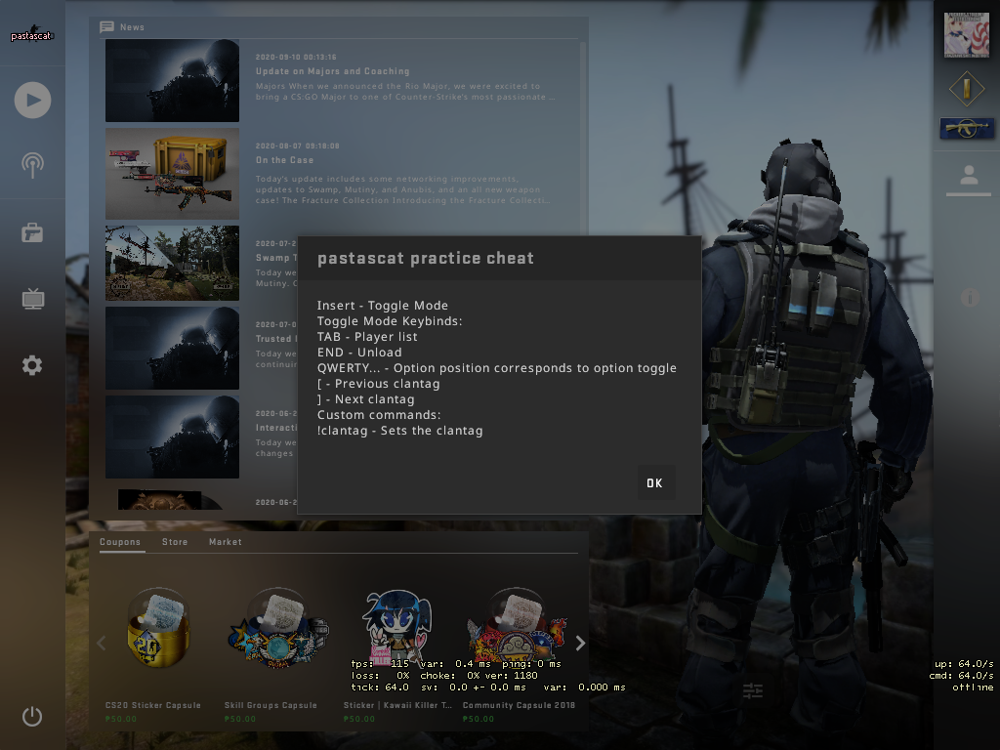

# pastascat - Test CS:GO internal cheat
This was a practice cheat to get familiar with x86 RE and CS:GO (planned to be another oss cheat). No longer going to continue

## Build
* Both the loader and dll should be located at the *./build/* directory

## Implemented
* Unload
* Hooks: Window procedure callback, ClientCMD, PaintTraverse

## Not implemented
* Everything else :>

## Libraries used:
* [xorstr](https://github.com/JustasMasiulis/xorstr) - for string obfuscation
* [minhook](https://github.com/TsudaKageyu/minhook) - for hooking functions